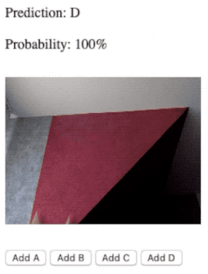

# Tensorflow.js Transfer Learning Image Classifier Example

## Project

This is the final result of the TensorFlow.js Transfer Learning Image Classifier tutorial on the codelabs website.

You can follow the tutorial at [Codelab Tensorflow tutorial](https://codelabs.developers.google.com/codelabs/tensorflowjs-teachablemachine-codelab/) to create your own Image Classifier.

This project uses the WebCam to predict 4 different classes.
To train the model you should hit the button when the object of the corresponding category appears on camera.

After enough images samples for each category, your model will predict accurately the object shown on camera.

## Steps

1. Go to this [page](https://cdessole.github.io/TensorFlow.js-Transfer-Learning-Image-Classifier/) to use the Image Classifier. You will need to grant WebCam privileges.

2. Show the object corresponding to each class (A to D) on camera and press the `Add #` button.

3. After enough training, you will see the right `Prediction` and high `Probability`. If not, you should add more training samples.

## Classic Example : Rock–paper–scissors 

I've seen this example multiple times to test this application.

4 classes : 
  - A: Rock
  - B: Paper
  - C: Scissors
  - D: Nothing

The gif below shows the result after 20 training samples for each class

